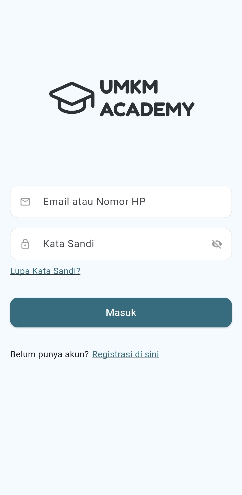
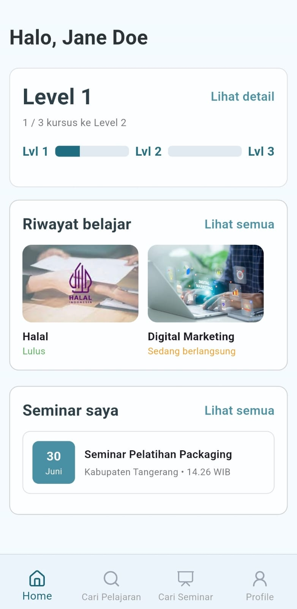
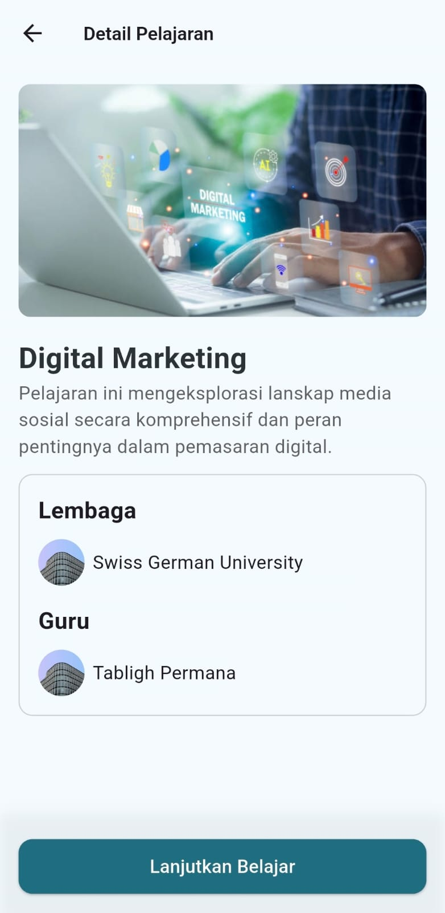
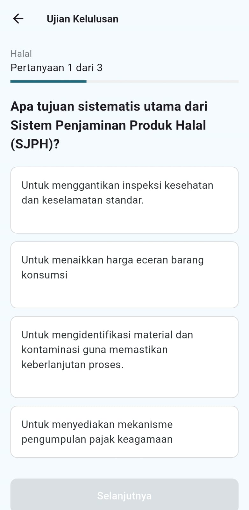
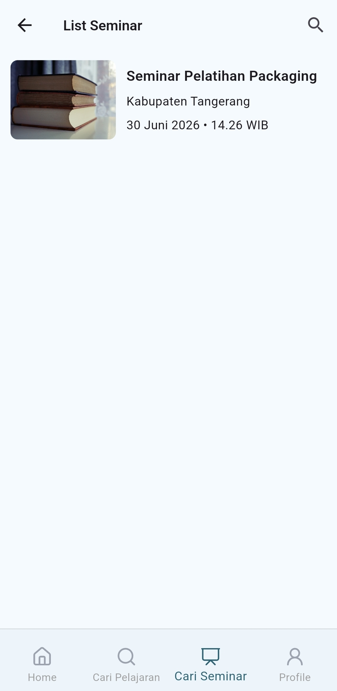

# Mobile Learning Application for UMKM Training

A mobile learning application developed as my Bachelor's Thesis at Swiss German University to support digital learning for Micro, Small, and Medium Enterprises (UMKM).

> **Note**
> This repository is intended to showcase the project. The source code is currently not included while the intellectual property (HKI) registration is being processed.

---

## Features

- User authentication
- Course enrollment
- Learning modules
- Video-based learning
- Quiz and assessment
- User profile management
- Progress tracking

---

## Tech Stack

| Category | Technology |
|----------|------------|
| Mobile | Flutter |
| Backend | Node.js |
| Database | Cloud Firestore |
| API | REST API |
| Deployment | Vercel |
| Design | Figma |

---

## Architecture

The mobile application follows the **MVVM (Model–View–ViewModel)** architecture to improve code maintainability, scalability, and separation of concerns.

```
lib/
├── models/
├── views/
├── viewmodels/
├── services/
├── repositories/
├── widgets/
└── utils/
```

### Architecture Overview

- **Model** – Represents application data and business objects.
- **View** – Flutter UI screens and widgets.
- **ViewModel** – Handles presentation logic and state management.
- **Repository/Services** – Manage communication with REST APIs and Cloud Firestore.

---

## Screenshots

<p align="center">
  <a href="screenshots/login.jpeg">
    
  </a>
  <a href="screenshots/home.jpeg">
    
  </a>
</p>

<p align="center">
  <a href="screenshots/course_detail.jpeg">
    
  </a>
  <a href="screenshots/quiz.jpeg">
    
  </a>
</p>

<p align="center">
  <a href="screenshots/list-seminar.jpeg">
    
  </a>
</p>

---

## Demo Video

Watch the application demo here:

https://drive.google.com/file/d/1qTr1as0AUZucwMIvxLD4wFKob7gob8sA/view?usp=drive_link

---

## 📖 User Manual

The user manual is available in the `docs` folder.

---

## System Architecture

```
Flutter App
      │
      ▼
REST API
(Node.js on Vercel)
      │
      ▼
Cloud Firestore
```

---

## My Role

This application was independently developed as part of my Bachelor's Thesis.

Responsibilities include:

- Designed the application architecture
- Developed the Flutter mobile application
- Developed the Node.js backend
- Designed REST APIs
- Integrated Cloud Firestore
- Conducted User Acceptance Testing (UAT)
- Evaluated user acceptance using the Technology Acceptance Model (TAM)

---

## License

Copyright © 2026 Melinda Santoso.

All rights reserved.
